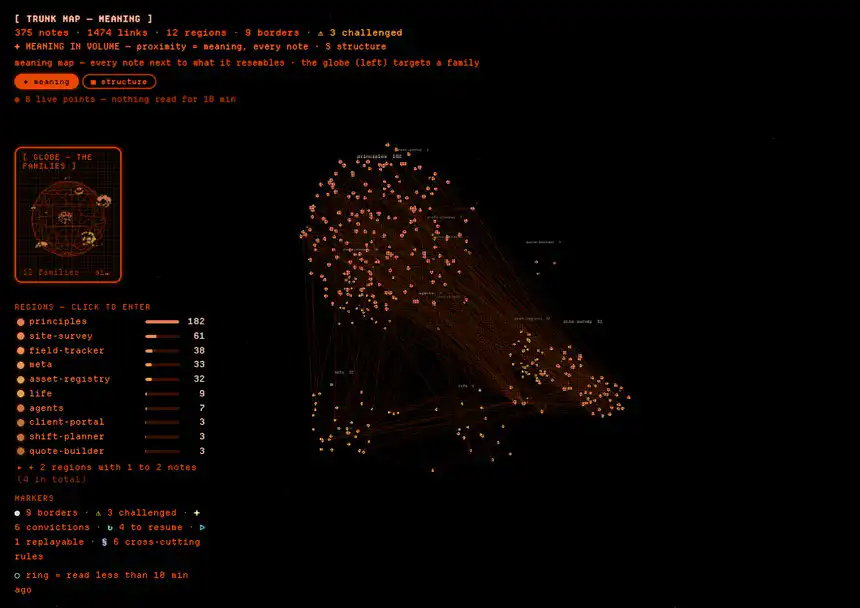
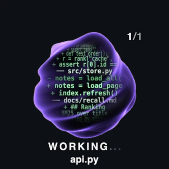
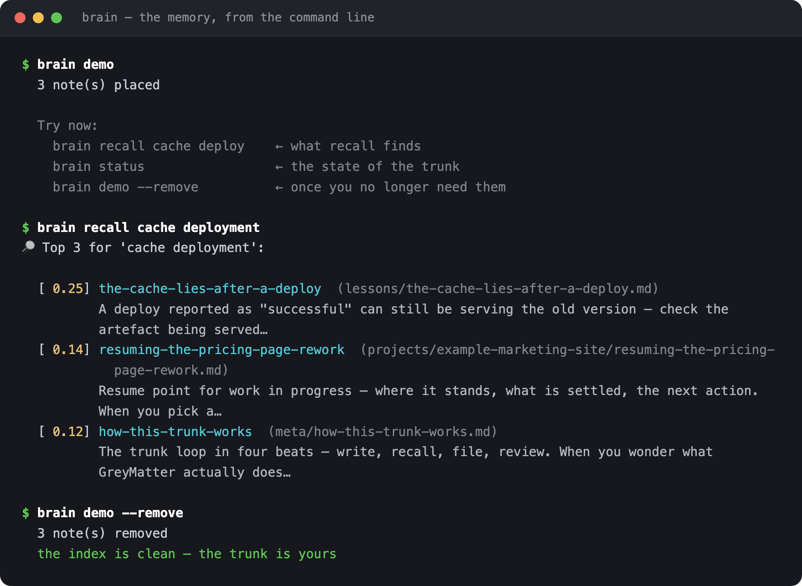

# GreyMatter

[](https://github.com/Yuno15-bb/GreyMatter-engine/actions/workflows/ci.yml)
[](https://github.com/Yuno15-bb/GreyMatter-engine/releases/latest)
[](LICENSE)
[](#compatibility)

**GreyMatter turns each session with your CLI agent into memory it can reuse —
distilled into a note, filed, linked, and handed back the moment you ask for
it. From any project, and without leaving your machine.**

<table width="100%">
<tr>
<td width="74%" align="center">
  
</td>
<td width="26%" align="center">
  
</td>
</tr>
<tr>
<td align="center"><sub><b>Map</b></sub></td>
<td align="center"><sub><b>Agents</b></sub></td>
</tr>
</table>

Your agent is brilliant within a session and amnesic between two. Solve
something on Monday, explain it again on Thursday. GreyMatter is the part that
remembers.

The more work piles up, the more useful the tree gets — the opposite of a
conversation history, which only gets longer.

---

## What it actually does

**The memory itself** — this is the product, and it is all you need:

- **A trunk.** Your lessons, projects and method, as markdown on your machine, versioned with git.
- **Recall on request.** Ask — `brain recall "…"`, `?brain` in a message, or a plain
  "any notes on…" — and the two or three notes that match are handed to your agent.
  `BRAIN_RECALL_AUTO=1` makes it fire on every prompt instead ([why it no longer does](#and-on-a-real-trunk-what-does-it-change)).
- **It does not go round in circles.** Notes are ranked by relevance alone, and one slot
  in three is kept for notes the search rarely surfaces, so the same few do not win forever.
- **It knows its own age.** Notes never re-checked enter a review queue, dated from the git history.
- **Four agents, eight missions.** Narcissus distills each session and files the result;
  Sulaco challenges, links and archives; Anesidora writes syntheses across projects;
  Nostromo repairs the wiring and watches the machine.
- **A closed loop.** Session ends → archive → distill → file, without being asked.
- **Updates.** Every session looks for a new version and your agent **asks you** before installing it; **your notes are never touched**.

**And two ways to look at it**, which are extensions and install separately —
`./install.sh --core-only` leaves both out:

- **A capsule.** A glass orb on your desktop showing the agents at work, live.
- **A map.** Everything you wrote as one navigable 3D map, rebuilt on every launch.

<p align="center">
  
</p>

### How good is the recall?

Measured, not asserted — `tests/recall_benchmark.py`, on a synthetic corpus
where finding the answer means picking one note out of ~120 that share its
subject and most of its vocabulary:

| notes | P@1 | P@3 | MRR | off-topic in what it hands back | per search (median) |
|---|---|---|---|---|---|
| 100 | 0.94 | 0.98 | 0.96 | 35% | 0.2 ms |
| 1000 | 0.79 | 0.93 | 0.86 | 24% | 2.4 ms |
| 5000 | 0.46 | 0.84 | 0.64 | 39% | 15 ms |

Measured 2026-09-27 on an Apple-silicon Mac. "Per search" is the search
alone; a fresh `brain recall` also loads its cached index first, about
0.1 s at 1,000 notes.

It holds to about a thousand notes and degrades sharply past that. Published
here because a memory tool that will not say how well it remembers is asking
for trust it has not earned. The CI enforces these numbers as thresholds.

**This bench does NOT measure everything.** Its corpus is synthetic, so its
vocabulary is coherent by construction: it says nothing about morphology
("ranger" versus "rangement") nor about the French/English mix, which are two
real causes of an unfindable note. Its numbers did not move when those two
points were fixed — that is a limit of the bench, not the absence of an effect.

### And on a real trunk, what does it change?

Measured on 2026-08-12 against the author's living Brain (312 notes), 10
questions about real facts of the author's work, 50 runs isolated from one another:

| what the assistant has | right answers | tokens per exchange |
|---|---|---|
| nothing | **0/10** | 178 k |
| the trunk + the map, **without** recall | **8/10** | 264 k |
| **the full system**, recall on every prompt | **10/10** | **168 k** |

When the question is about the trunk, recall does not cost context, it **saves**
it: with no suggestion the assistant has to search, and searching burns turns.
The detail of the protocol — and the three campaigns that had to be thrown away
before an honest measurement came out — lives in the author's trunk, not here.

**Why recall now waits to be asked.** Most prompts are not questions about the
trunk. Over the following month of daily use, 3,256 notes were offered on their
own and 139 of them were opened afterwards — 4.27 %. The suggestion block cost
its noise on every message for a service rendered about four times in a hundred,
so since 2026-09-09 it fires only when you ask. The search itself did not
change: the numbers above still hold whenever you do.

### And on a public benchmark?

[LongMemEval](https://github.com/xiaowu0162/LongMemEval) asks 500 questions,
each hidden in a long history of past conversations: about 48 of them per
question in its S set, about 475 in its M set. We measured **retrieval only** —
is a conversation holding the answer among the five handed back
(recall-any@5)? — not whether an agent then answers correctly. Measured
2026-09-26, same questions and same scoring for every system:

| system | S (~48 conversations) | M (~475 conversations) |
|---|---|---|
| **GreyMatter**, default search | **96.8 %** | **86.4 %** |
| a plain BM25, nothing else | 96.8 % | 86.8 % |
| claude-mem's search alone (Chroma, one message per entry) | 96.4 % | 83.0 % |
| agentmemory hybrid, its own code at `bcf4f0d` | 95.6 % | 78.6 % |
| GreyMatter, semantic mode | 88.2 % | 61.0 % |

**Read it for what it says.** GreyMatter's default search ties a plain BM25 —
the textbook keyword ranking — on both sets (no significant difference:
p = 1.0 on S, p = 0.77 on M). It is ahead of claude-mem's search on M
(p = 0.046), and only its search: claude-mem's full memory was not tested.
agentmemory advertises 95.2 %; we measured 95.6 % on S and 78.6 % on M. So the
bench shows GreyMatter is not behind — not that it is better than the simplest
baseline. Its semantic mode (`brain recall --semantic`, static embeddings) loses on
both sets; it stays off unless you ask for it.

## Install

**As a Claude Code plugin** — the short way, and the one that updates itself:

```
/plugin marketplace add Yuno15-bb/GreyMatter-engine
/plugin install greymatter@greymatter
```

That gives you the whole memory: the trunk, recall, the four agents,
the `brain` command inside Claude Code (your own terminal gets it from the full
install below), and three commands you can type — `/greymatter:recall`,
`/greymatter:distill`, `/greymatter:doctor`. It creates `~/.greymatter/trunk` on your first session and
tells you so. It does **not** set up the capsule, the planet or the scheduled
jobs — a plugin cannot install a background service, and pretending otherwise
would leave you with a window that never opens.

**The full install** — everything above, plus the capsule, the planet and the
unattended maintenance:

```
Install GreyMatter: clone https://github.com/Yuno15-bb/GreyMatter-engine into ~/dev/greymatter, read its INSTALL.md,
then run ./install.sh and show me the final verification output.
```

Or by hand: `git clone … && cd greymatter && ./install.sh`

> **Upgrading from v2.0.x?** `brain update` carries you across the rename to
> GreyMatter on its own; [docs/UPGRADING.md](docs/UPGRADING.md) says what moves
> and how to roll back.
>
> **Upgrading from v1.28.1 or earlier?** Read
> [docs/UPGRADING.md](docs/UPGRADING.md) first — a one-time warning about
> uncommitted changes in your engine checkout, the renamed agents, and recall
> on request. Your notes are not affected.

**The memory and nothing else** — no Electron window, no 3D globe, no
background job:

```bash
./install.sh --core-only
```

The `brain` command lands in `~/.local/bin`. If your shell says
`command not found`, that folder is not on your `PATH` yet — the installer
prints the one line to add to your shell profile.

Details, prerequisites and uninstall: **[INSTALL.md](INSTALL.md)**.

## The idea holding it all together

```
~/.greymatter/engine  ← link to the ACTIVE version under versions/. Code, replaceable, disposable.
~/.greymatter/trunk     ← the TRUNK. Your notes. Changes only when YOU write.
```

The two never mix. That is what lets an update land with zero risk to your work —
and lets `uninstall.sh` remove everything while leaving your knowledge intact.

Both live behind a leading dot, out of the way. Your notes should not: the
install puts a **`GreyMatter` shortcut in your home folder**, tagged, so the one
part that is yours is the one part you can see.

Since v2.1.0 the engine carries one name everywhere — folder, commands, launchd
jobs, plugin. An older install is moved over by its own updater: the root moves
once, the old path stays behind as a link to it, and your notes are not
rewritten. What changes and how to go back: [docs/UPGRADING.md](docs/UPGRADING.md).

<p align="center">
  
</p>

## What it does not do

- **It makes no request of its own.** No telemetry, no network call beyond
  `git pull`. What travels is what your prompts already carry: when you ask
  for recall, the hook adds the name, description and path of two or three
  notes to that prompt, and agents you start read whole notes. Both go to your
  model provider, like the rest of your message. [`SECURITY.md`](SECURITY.md)
  spells out where the line is.
- **It asks before it updates.** Every session start looks for a newer
  published version, in the background. When there is one, your agent asks you
  whether to install it, and nothing runs until you say yes. If you would rather
  it installed on its own, `brain update --auto-on` does that (it was the
  default from v1.28.0 to v2.1.0). The trunk is never touched, and a version
  whose selftest goes red is never activated.
- **It ships no knowledge.** Your tree starts empty, and the three skills it
  does ship only drive the tool. See [`skills/README.md`](skills/README.md) for
  the reasoning: we pass on the method, not somebody else's lived experience.

## The extensions

This repository provides two desktop interfaces, and only these two: the
**capsule** and the **planet**. The installer puts `GreyMatter.app` on your
Desktop; it opens the planet in your browser (`http://localhost:8765`). The
capsule opens on its own when the agents start working, or with `brain capsule`.
No release ships any other desktop app. When one does, it will be in this
repository and its release notes will say so.

Neither of the two below is the product. They are how you *watch* it — pleasant,
optional, and skipped entirely by `./install.sh --core-only`. The plugin install
never sets them up at all, because a plugin cannot install a background service.

### The capsule

A pane of living glass in the corner of your screen. It does not decorate: it
carries three separate channels, and the first two read **without colour**.

| Channel | What it says |
|---|---|
| **Fluid mechanic** | the nature of the work — swell, sweep, vortex, shards |
| **Speed and amplitude** | how intense that step is |
| **Hue** | the family of agent — four, not thirteen |

Inside the sphere, the lines your agents are **actually writing** scroll by, bent
around the curve. When nothing has been written for a while it falls back to the
file the running agent executes — because an agent spends long minutes reading
without writing, and that is exactly when you look at it.

It clears itself off the desktop a minute after the work ends, and comes back on
the first agent. Clicks pass straight through it, except on the sphere itself:
grab it there and drop it wherever you like.

<p align="center">
  
</p>
<p align="center"><sub>At its real size, one state per family — then back to rest.</sub></p>

Rest costs about 5 % of one core, work about 9 %. The cost follows the frame
rate, almost not the geometry — so the rate drops at rest and rises only during
transitions, where a dropped frame would read as a stutter.

### The planet

Every note is a dot, every `[[link]]` an arc, rebuilt from your trunk on each
launch — projects become cities, cross-cutting lessons become regions.

What opens is the **meaning map**: every note placed next to what it resembles,
folders ignored. That is where the map earns its place — two notes sitting
against each other here while your filing keeps them apart is a link you have
not written yet.

The **filing** is the second view, not the first: a small globe in the left
column holds it, one cluster per region. Aim a region in it and the same notes
light up in the map. `V` brings the filing back full size when you want to walk
it.

Point at a note: its links light up and the panel gives you the region, the
title and the summary — nothing more, because hovering is how you sweep. Click
it and the panel opens out: the plain-language section, the full note behind it,
and the connections at the end.

Points warm up as you read them and fade on their own; the ⚠ ✦ ↻ ▷ markers flag
what was challenged, held as a conviction, left open, or is replayable in 3D.

<p align="center">
  
</p>
<p align="center"><sub>A showcase trunk of 375 notes and 1 474 links — the real shape of a working trunk, with generated titles. Yours starts empty.</sub></p>

**[Full planet documentation](docs/planet.md)** — the two views, reading a
point, the markers, and what the map cannot do.

## Commands

Inside your agent, once the plugin is installed:

```
/greymatter:recall <subject>   what the trunk already knows about it
/greymatter:distill            turn what was just worked out into a note
/greymatter:doctor             check the wiring and the trunk
```

And in any shell once `install.sh` has run — with the plugin alone, ask Claude to run them:

<p align="center">
  
</p>

```bash
brain status          where the trunk stands
brain recall <word>   search your memory
brain doctor          tree health (dead links, inconsistencies)
brain review          full audit of the trunk
brain next            your resume points
brain capsule         open the floating orb  (stop · status)
brain selftest        verify the installation
brain update          update the engine  (--check · --rollback)
                      session start looks, your agent asks · --auto-on installs without asking
brain version         installed version
```

## Compatibility

**macOS.** launchd, Electron and `open` are used.

**Claude Code** for the full experience: it is what fires the hooks (recall,
archiving, autonomous maintenance, status line). With another CLI agent, GreyMatter
installs and works **on demand** — trunk, agents, `brain`, planet, capsule — but
without the closed loop. The installer detects this and says so, rather than
pretending otherwise.

**Linux is not supported yet, and the gap is smaller than it looks.** Reading
the code rather than guessing: macOS is assumed in exactly four places — the
platform check in `install.sh`, the `launchd` job templates, the Desktop app
bundle, and the Finder `xattr` tag. Claude Code is assumed in one
file, `merge_settings.py`. Everything else — the trunk, recall, the agents, the
`brain` CLI, the hooks themselves — is portable Python and shell already.

So this is a portable core with two thin adapters, not a macOS product. The
order it will be done in: **`systemd` units in place of `launchd`, a `.desktop`
entry in place of the `.command` file, no Finder tag, and `--core-only` as the
default shape on Linux.** No date attached to that; saying which four places
have to change is more use than a promise.

## Language

`main` is the product, and it is English: the docs, the installer, the CLI,
the agents, the hooks and the capsule and planet interfaces. The French
original lives on the **`fr` branch**, the staging copy the engine is extracted
from; see [`docs/translation.md`](docs/translation.md).

Recall understands requests in French as well as English. A single setting
that switches every surface to French, without a second install, is planned
and not built.

## For the curious

- [`docs/design-doc.md`](docs/design-doc.md) — the problem, the rejected
  alternatives, the traps hit along the way and how each was closed.
- `sync.sh` + `rules.json` + `leakcheck.py` — the chain that extracts this engine
  from a real, personal Brain without letting a single line of lived experience
  escape.
- [`CONTRIBUTING.md`](CONTRIBUTING.md) — how the two branches relate, and why a
  hand-edited engine file on `fr` disappears on the next sync.
- [`SECURITY.md`](SECURITY.md) — what this writes to your machine, what runs
  unattended, and how to report a hole privately.
- [`CHANGELOG.md`](CHANGELOG.md) — generated from the tags, so it cannot drift.

## Licence

**Apache 2.0** — see [LICENSE](LICENSE).

You may use it, study it, modify it, redistribute it, and build on it, including
commercially. The licence includes a patent grant, and asks only that you keep
the attribution and state your changes.

Everything you write with it — your notes, your trunk, your skills — is yours,
and this licence makes no claim on it.
