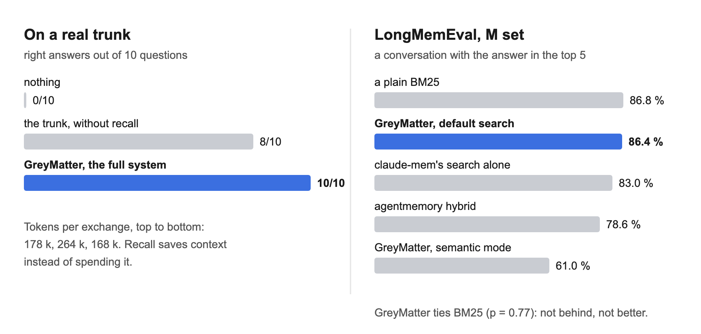

<p align="center">
  <a href="https://peellaertech.com/en/projects/greymatter/">
    
  </a>
</p>

<h1 align="center">GreyMatter</h1>

<p align="center">
  <b>GreyMatter turns each session with your CLI agent into memory it can reuse —
  distilled into a note, filed, linked, and handed back the moment you ask for
  it. From any project, and without leaving your machine.</b>
</p>

<div align="center">

[](https://github.com/Yuno15-bb/GreyMatter-engine/actions/workflows/ci.yml)
[](https://github.com/Yuno15-bb/GreyMatter-engine/releases/latest)
[](LICENSE)
[](#compatibility)

[Website](https://peellaertech.com/en/projects/greymatter/) ·
[Install](#install) ·
[How it works](#how-it-works) ·
[Changelog](CHANGELOG.md) ·
[Security](SECURITY.md)

</div>

<p align="center">
  
</p>

> Your agent is brilliant within a session and amnesic between two. Solve
> something on Monday, explain it again on Thursday. **GreyMatter is the part that
> remembers** — and the more work piles up, the more useful the tree gets, the
> opposite of a conversation history, which only gets longer.

<p align="center">
  <a href="#what-it-does">What it does</a> ·
  <a href="#how-well-it-recalls">How well it recalls</a> ·
  <a href="#watch-it-work">Watch it work</a> ·
  <a href="#install">Install</a> ·
  <a href="#how-it-works">How it works</a> ·
  <a href="#commands">Commands</a> ·
  <a href="#at-a-glance">At a glance</a> ·
  <a href="#going-further">Going further</a>
</p>

## What it does

<table>
<tr>
<td width="50%" valign="top">

🌳 **A trunk**<br>
Your lessons, projects and method, as markdown on your machine, versioned with git.

</td>
<td width="50%" valign="top">

🔎 **Recall on request**<br>
Ask — `brain recall "…"`, `?brain` in a message, or a plain "any notes on…" — and the two or three notes that match are handed to your agent.

</td>
</tr>
<tr>
<td width="50%" valign="top">

🔁 **A closed loop**<br>
Session ends → archive → distill → file, without being asked.

</td>
<td width="50%" valign="top">

🚀 **Four agents, eight missions**<br>
Narcissus distills each session and files the result; Sulaco challenges, links and archives; Anesidora writes syntheses across projects; Nostromo repairs the wiring and watches the machine.

</td>
</tr>
<tr>
<td width="50%" valign="top">

🎯 **No going round in circles**<br>
Notes are ranked by relevance alone, and one slot in three is kept for notes the search rarely surfaces, so the same few do not win forever.

</td>
<td width="50%" valign="top">

⏳ **It knows its own age**<br>
Notes never re-checked enter a review queue, dated from the git history.

</td>
</tr>
<tr>
<td width="50%" valign="top">

⬆️ **Updates that ask**<br>
Every session looks for a new version and your agent **asks you** before installing it; **your notes are never touched**.

</td>
<td width="50%" valign="top">

🖥️ **Two ways to watch it**<br>
A menu bar pill and a map app — [below](#watch-it-work). Optional, and installed separately: the memory is the product.

</td>
</tr>
</table>

`BRAIN_RECALL_AUTO=1` makes recall fire on every prompt instead ([why it no longer does](#on-a-real-trunk)).

## How well it recalls

<p align="center">
  
</p>

Three measurements, from the most controlled to the most real. Each one says
what it does not show. A memory tool that will not say how well it remembers is
asking for trust it has not earned.

| | measured (2026) | what it tells you |
|---|---|---|
| [Synthetic bench](#on-a-synthetic-bench) | Sep 27 | 2.4 ms per search at 1,000 notes, 15 ms at 5,000; it holds to about a thousand notes and degrades sharply past that |
| [Real trunk](#on-a-real-trunk) | Aug 12 | 10/10 right answers with recall, 0/10 without anything — and fewer tokens spent |
| [LongMemEval](#on-a-public-benchmark) | Sep 26 | ties a plain BM25, ahead of claude-mem's search on the larger set |

<details>
<summary><b>On a synthetic bench</b> — speed and precision as the trunk grows</summary>

### On a synthetic bench

Measured, not asserted — `tests/recall_benchmark.py`, on a synthetic corpus
where finding the answer means picking one note out of ~120 that share its
subject and most of its vocabulary:

| notes | P@1 | P@3 | MRR | off-topic in what it hands back | per search (median) |
|---|---|---|---|---|---|
| 100 | 0.94 | 0.98 | 0.96 | 35% | 0.2 ms |
| 1000 | 0.79 | 0.93 | 0.86 | 24% | 2.4 ms |
| 5000 | 0.46 | 0.84 | 0.64 | 39% | 15 ms |

Measured 2026-09-27 on an Apple-silicon Mac. "Per search" is the search
alone; a fresh `brain recall` also loads its cached index first, about
0.1 s at 1,000 notes. The CI enforces these numbers as thresholds.

**What this bench does NOT measure.** Its corpus is synthetic, so its vocabulary
is coherent by construction: it says nothing about morphology ("ranger" versus
"rangement") nor about the French/English mix, which are two real causes of an
unfindable note. Its numbers did not move when those two points were fixed —
that is a limit of the bench, not the absence of an effect.

</details>

<details>
<summary><b>On a real trunk</b> — 10 questions, 50 isolated runs, and why recall now waits to be asked</summary>

### On a real trunk

Measured on 2026-08-12 against the author's living Brain (312 notes), 10
questions about real facts of the author's work, 50 runs isolated from one another:

| what the assistant has | right answers | tokens per exchange |
|---|---|---|
| nothing | **0/10** | 178 k |
| the trunk + the map, **without** recall | **8/10** | 264 k |
| **the full system**, recall on every prompt | **10/10** | **168 k** |

When the question is about the trunk, recall does not cost context, it **saves**
it: with no suggestion the assistant has to search, and searching burns turns.
The detail of the protocol — and the three campaigns that had to be thrown away
before an honest measurement came out — lives in the author's trunk, not here.

**Why recall now waits to be asked.** Most prompts are not questions about the
trunk. Over the following month of daily use, 3,256 notes were offered on their
own and 139 of them were opened afterwards — 4.27 %. The suggestion block cost
its noise on every message for a service rendered about four times in a hundred,
so since 2026-09-09 it fires only when you ask. The search itself did not
change: the numbers above still hold whenever you do.

</details>

<details>
<summary><b>On a public benchmark</b> — LongMemEval, 500 questions, five systems</summary>

### On a public benchmark

[LongMemEval](https://github.com/xiaowu0162/LongMemEval) asks 500 questions,
each hidden in a long history of past conversations: about 48 of them per
question in its S set, about 475 in its M set. We measured **retrieval only** —
is a conversation holding the answer among the five handed back
(recall-any@5)? — not whether an agent then answers correctly. Measured
2026-09-26, same questions and same scoring for every system:

| system | S (~48 conversations) | M (~475 conversations) |
|---|---|---|
| **GreyMatter**, default search | **96.8 %** | **86.4 %** |
| a plain BM25, nothing else | 96.8 % | 86.8 % |
| claude-mem's search alone (Chroma, one message per entry) | 96.4 % | 83.0 % |
| agentmemory hybrid, its own code at `bcf4f0d` | 95.6 % | 78.6 % |
| GreyMatter, semantic mode | 88.2 % | 61.0 % |

**Read it for what it says.** GreyMatter's default search ties a plain BM25 —
the textbook keyword ranking — on both sets (no significant difference:
p = 1.0 on S, p = 0.77 on M). It is ahead of claude-mem's search on M
(p = 0.046), and only its search: claude-mem's full memory was not tested.
agentmemory advertises 95.2 %; we measured 95.6 % on S and 78.6 % on M. So the
bench shows GreyMatter is not behind — not that it is better than the simplest
baseline. Its semantic mode (`brain recall --semantic`, static embeddings) loses on
both sets; it stays off unless you ask for it.

</details>

## Watch it work

> [!NOTE]
> **v2.2 · in development.** The menu bar pill and the map app below are on
> `main` and not yet in a release. **v2.1.1**, what you install today, ships the
> floating orb and the planet in your browser —
> [its README](https://github.com/Yuno15-bb/GreyMatter-engine/tree/v2.1.1#the-extensions)
> shows them.

Two native macOS programs, built on your Mac by the installer — no Electron, no
browser tab. Neither is the product: they are how you *watch* it, optional, and
skipped by `--core-only` and by the plugin install.

<p align="center">
  
</p>

<table>
<tr>
<td width="50%" valign="top">

**The pill** — in the menu bar, the agent at work and what it is doing:
`NARCISSUS distilling`. The orb's colour and motion follow the kind of work, so
it reads at a glance without the words. Click it for the task, how long it has
run, and the agents that took part, one station each.

</td>
<td width="50%" valign="top">

**The map** — `GreyMatter.app` on your Desktop, the video at the top of this
page. Every region of your trunk as a cluster; enter one and its notes unfold
into a sphere you turn with the mouse. Click a note to open it in two layers:
the plain-language section for you, the complete note for the model.

</td>
</tr>
</table>

<details>
<summary><b>More on the pill and the map</b></summary>

Both need Swift, which comes with Apple's Command Line Tools
(`xcode-select --install`). Without it, the installer skips only these two and
says so; the memory works the same.

**The pill** reflects **real** operations — the hooks write `state/status.json`
on every action and the pill reads it; it invents nothing. `brain capsule` opens
it, `brain capsule stop` closes it. How it is built and how to keep it off:
[capsule/README.md](capsule/README.md).

**The map** opens with a short self-test, then asks for your access code: the
map is locked behind one, chosen on first launch and stored only as a hash. Each
region shows its number of notes; point at a note and its preview appears.

The **graph** view spreads every note out in volume by meaning, each region
kept together, so two notes about the same thing sit side by side even with no
link between them; point at a note and its links light up. Placing by meaning
needs the optional embeddings index (the one `brain recall --semantic` uses);
without it, the graph view keeps the panel's layout.

Along the bottom, three panes: the regions and their share of notes, what this
session has read, written and committed, and the lines being written right now.

It is read-only: nothing you do in the map changes a note. It is rebuilt from
your trunk on every launch, and quitting the app stops its local server.

</details>

## Install

**As a Claude Code plugin** — the short way:

```
/plugin marketplace add Yuno15-bb/GreyMatter-engine
/plugin install greymatter@greymatter
```

**The full install** — ask your agent:

```
Install GreyMatter: clone https://github.com/Yuno15-bb/GreyMatter-engine into ~/dev/greymatter, read its INSTALL.md,
then run ./install.sh and show me the final verification output.
```

Or by hand: `git clone … && cd greymatter && ./install.sh` — add `--core-only` for the memory and nothing else.

| | Plugin | Full install | `--core-only` |
|---|:---:|:---:|:---:|
| Trunk, recall, the four agents | ✅ | ✅ | ✅ |
| `/greymatter:recall` · `:distill` · `:doctor` | ✅ | — | — |
| `brain` in your own terminal | inside Claude Code | ✅ | ✅ |
| Menu bar pill and map app | — | ✅ | — |
| Scheduled maintenance jobs (launchd) | — | ✅ | — |

The plugin creates `~/.greymatter/trunk` on your first session and tells you so.
It does not set up the pill, the map or the scheduled jobs — a plugin cannot
install a background service, and pretending otherwise would leave you with a
window that never opens.

The `brain` command lands in `~/.local/bin`. If your shell says
`command not found`, that folder is not on your `PATH` yet — the installer
prints the one line to add to your shell profile. Details, prerequisites and
uninstall: **[INSTALL.md](INSTALL.md)**.

<details>
<summary><b>Upgrading from an older version</b></summary>

**From v2.0.x?** `brain update` carries you across the rename to GreyMatter on
its own; [docs/UPGRADING.md](docs/UPGRADING.md) says what moves and how to roll
back. Since v2.1.0 the engine carries one name everywhere — folder, commands,
launchd jobs, plugin. The root moves once, the old path stays behind as a link
to it, and your notes are not rewritten.

**From v1.28.1 or earlier?** Read [docs/UPGRADING.md](docs/UPGRADING.md) first —
a one-time warning about uncommitted changes in your engine checkout, the
renamed agents, and recall on request. Your notes are not affected.

</details>

## How it works

<p align="center">
  
</p>

### The idea holding it all together

```
~/.greymatter/engine  ← link to the ACTIVE version under versions/. Code, replaceable, disposable.
~/.greymatter/trunk     ← the TRUNK. Your notes. Changes only when YOU write.
```

The two never mix. That is what lets an update land with zero risk to your work —
and lets `uninstall.sh` remove everything while leaving your knowledge intact.
Both hide behind a leading dot; your notes should not, so the install puts a
tagged **`GreyMatter` shortcut in your home folder**.

<p align="center">
  
</p>

## Commands

Inside your agent, once the plugin is installed:

```
/greymatter:recall <subject>   what the trunk already knows about it
/greymatter:distill            turn what was just worked out into a note
/greymatter:doctor             check the wiring and the trunk
```

In any shell once `install.sh` has run — with the plugin alone, ask Claude to run them:

```bash
brain status          where the trunk stands
brain recall <word>   search your memory
brain doctor          tree health (dead links, inconsistencies)
brain review          full audit of the trunk
brain next            your resume points
brain capsule         open the capsule  (stop · status)
brain selftest        verify the installation
brain update          update the engine  (--check · --rollback)
                      session start looks, your agent asks · --auto-on installs without asking
brain version         installed version
```

## At a glance

<table>
<tr>
<td width="28%" valign="top">

🔒 **No request of its own**

</td>
<td valign="top">

No telemetry, no network call beyond `git pull`. What travels is what your prompts already carry: when you ask for recall, the hook adds the name, description and path of two or three notes to that prompt, and agents you start read whole notes. Both go to your model provider, like the rest of your message — [`SECURITY.md`](SECURITY.md) spells out where the line is.

</td>
</tr>
<tr>
<td width="28%" valign="top">

⬆️ **It asks before it updates**

</td>
<td valign="top">

Every session start looks for a newer published version, in the background. When there is one, your agent asks you whether to install it, and nothing runs until you say yes. `brain update --auto-on` installs on its own instead (the default from v1.28.0 to v2.1.0). The trunk is never touched, and a version whose selftest goes red is never activated.

</td>
</tr>
<tr>
<td width="28%" valign="top">

📭 **It ships no knowledge**

</td>
<td valign="top">

Your tree starts empty, and the three skills it does ship only drive the tool — we pass on the method, not somebody else's lived experience ([`skills/README.md`](skills/README.md)).

</td>
</tr>
<tr>
<td width="28%" valign="top">

🍎 **macOS**

</td>
<td valign="top">

launchd and `open` are used; the pill and the map app are built with Swift from Apple's Command Line Tools.

</td>
</tr>
<tr>
<td width="28%" valign="top">

🐧 **Linux**

</td>
<td valign="top">

Not supported yet — and the gap is smaller than it looks (below).

</td>
</tr>
<tr>
<td width="28%" valign="top">

🤖 **Claude Code**

</td>
<td valign="top">

The full experience: it fires the hooks (recall, archiving, autonomous maintenance, status line). With another CLI agent, GreyMatter installs and works **on demand** — trunk, agents, `brain`, map, pill — but without the closed loop. The installer detects this and says so.

</td>
</tr>
<tr>
<td width="28%" valign="top">

🌍 **Language**

</td>
<td valign="top">

English everywhere: docs, installer, CLI, agents, hooks, interfaces. Recall understands requests in French as well. A single setting that switches every surface to French is planned and not built.

</td>
</tr>
</table>

<details>
<summary><b>Linux: exactly four places assume macOS</b></summary>

Reading the code rather than guessing: macOS is assumed in exactly four places —
the platform check in `install.sh`, the `launchd` job templates, the Desktop app
bundle, and the Finder `xattr` tag. Claude Code is assumed in one
file, `merge_settings.py`. Everything else — the trunk, recall, the agents, the
`brain` CLI, the hooks themselves — is portable Python and shell already.

So this is a portable core with two thin adapters, not a macOS product. The
order it will be done in: **`systemd` units in place of `launchd`, a `.desktop`
entry in place of the `.command` file, no Finder tag, and `--core-only` as the
default shape on Linux.** No date attached to that; saying which four places
have to change is more use than a promise.

</details>

<details>
<summary><b>Where the French lives</b></summary>

`main` is the product, and it is English. The French original lives on the
**`fr` branch**, the staging copy the engine is extracted from; see
[`docs/translation.md`](docs/translation.md).

</details>

## Going further

<table>
<tr>
<td width="34%" valign="top">

[`docs/design-doc.md`](docs/design-doc.md)

</td>
<td valign="top">

The problem, the rejected alternatives, the traps hit along the way and how each was closed.

</td>
</tr>
<tr>
<td width="34%" valign="top">

`sync.sh` · `rules.json` · `leakcheck.py`

</td>
<td valign="top">

The chain that extracts this engine from a real, personal Brain without letting a single line of lived experience escape.

</td>
</tr>
<tr>
<td width="34%" valign="top">

[`CONTRIBUTING.md`](CONTRIBUTING.md)

</td>
<td valign="top">

How the two branches relate, and why a hand-edited engine file on `fr` disappears on the next sync.

</td>
</tr>
<tr>
<td width="34%" valign="top">

[`SECURITY.md`](SECURITY.md)

</td>
<td valign="top">

What this writes to your machine, what runs unattended, and how to report a hole privately.

</td>
</tr>
<tr>
<td width="34%" valign="top">

[`CHANGELOG.md`](CHANGELOG.md)

</td>
<td valign="top">

Generated from the tags, so it cannot drift.

</td>
</tr>
</table>

## Licence

**Apache 2.0** — see [LICENSE](LICENSE). Use it, study it, modify it,
redistribute it and build on it, including commercially. The licence includes a
patent grant, and asks only that you keep the attribution and state your changes.

Everything you write with it — your notes, your trunk, your skills — is yours,
and this licence makes no claim on it.
