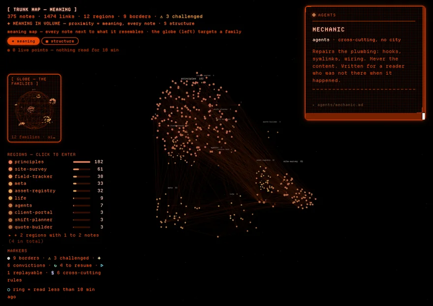
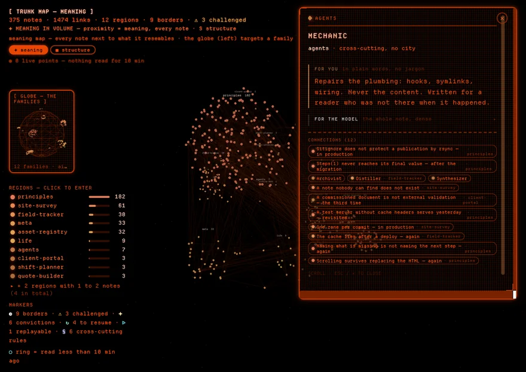

# The planet

A three-dimensional map of everything your trunk knows. Every point is a note,
every line a `[[link]]` you wrote.

[Launching](#launching) · [The two views](#the-two-views-and-what-each-one-means) ·
[Reading a point](#reading-a-point) · [Hover, then click](#hover-then-click--two-panels-not-one) ·
[The top bar](#the-top-bar) · [Limits](#what-the-map-cannot-do) ·
[Where the data comes from](#where-the-data-comes-from)

| It answers | How the map shows it |
|---|---|
| **Where am I working right now?** | recently read points warm up, the rest fade |
| **What is related to what, without my having decided it?** | the *meaning* view places notes by content similarity, not by folder |
| **What is still hanging?** | notes that were challenged, held as convictions, or left open carry a marker |

It is not decoration: those are three questions no file listing can ask.

## Launching

```bash
planet/launch.sh          # http://localhost:8765
planet/launch.sh 8770     # another port, if 8765 is taken
```

| Version | What the **GreyMatter** app on your Desktop opens |
|---|---|
| v2.2.0 and later | the map (`gmtr/`) in its own window; the planet stays reachable with `planet/launch.sh` |
| v2.1.1 and earlier | this planet, through the same launcher, in your browser as *3D/2D Knowledge Map — GreyMatter* |

The launcher rebuilds the graph **before** opening the page, so the map never
shows a stale state.

<details>
<summary><b>What happens while it is open, and the name it announces</b></summary>

Nothing is stored between launches: close the tab and it all comes back from
the trunk next time.

While the page is open, heat and activity update on the existing scene. A change
to a note's content or title changes the scene signature and rebuilds its points;
the visible rebuild counter makes this distinction observable.

It announces itself as `📟 Trunk planet — MOTHER signature`. MOTHER is the
phosphor-and-frame look the map wears — the one the ship's terminal wears in
*Alien* — and the launcher names it so you can tell at a glance which face you
are about to get.

</details>

## The two views, and what each one means

| Key | View | What POSITION means |
|---|---|---|
| — | **meaning** *(what opens)* | **resemblance** — two nearby notes talk about the same thing, even with no link between them |
| `V` | **the globe** | **filing** — region = folder, city = project |

The meaning map tells you what a note *resembles*; the globe tells you where you
*filed* it. A note alone in its folder but sitting against five others in the
meaning view is a link you have not written yet. `Esc` backs out of a region you
entered.

<details>
<summary><b>Why the meaning map opens first, and the small globe beside it</b></summary>

**The meaning map is what opens**, and the globe rides in the left column as a
small instrument: aim a region in it and the same notes light up in the map.
`V` gives the globe the whole screen back when you want to walk the filing
itself. It used to be the other way round — the globe first, the meaning map
behind a key — and the map turned out to be the thing worth landing on.

The small globe has two ways to group the notes, switched in its header:
**folders** — where you filed them — and **topics** — the subject each note
declares. The topic names come from the graph, whose exporter reads them from
the trunk's `meta/topics.json`; a trunk without that file has no topics to show.

</details>

<details>
<summary><b>The semantic layout, measured</b></summary>

The **semantic layout** places notes by meaning rather than by folder. It uses
three coordinates: projecting 256 dimensions onto a plane keeps 6.6% of each
note's semantic neighbourhood, three axes keep 11.9%. Neither number is high —
most of 256 dimensions cannot survive — but the comparison is what chose the
dimension, and `brain_embed2.py --cohesion` re-measures it rather than asking you
to trust the sentence you just read.

</details>

### When there is no meaning to show

| The trunk's real state | What the banner says |
|---|---|
| every note carries a vector | *"proximity = meaning, every note"* |
| an indexing pass is catching up | the count — *"412 of 430 notes placed by meaning"* |
| no semantic module | that it is showing **structure** |
| a cache that is unreadable | that — rather than falling back quietly |
| a cache that matches none of your current notes | that, too |

Placing notes by resemblance needs vectors, and those come from the semantic
module, which is **optional by design** — a plain install ships BM25 search and
no embeddings at all. So the honest answer to "what does the meaning view show
on a fresh trunk?" is: nothing yet, and it now says so.

<details>
<summary><b>Why this is spelled out — it was wrong for a month</b></summary>

The banner reads the trunk's real state instead of a fixed sentence. This is
worth spelling out because it was wrong for a month: the map opened on the
meaning view announcing every note, over a cloud where not one note had a
vector. Every point sat at its structural position, and the failed recompute was
swallowed by a `|| true`. `tests/planet_semantic_honesty.py` now holds the five
states, and the maintenance log says out loud when an index is not rebuilt.

</details>

## Reading a point

| What you see | What it means |
|---|---|
| **Colour** | the region: principles, meta, life, agents, projects |
| **The orange halo** | heat — how recently the note was activated. It decays on its own; a note never re-read goes dark |
| **The ring** | notes actually **read** in the last few minutes, not notes the recall merely offered |

The ring's distinction matters: the first version counted everything offered
across a whole session and left a third of the map lit permanently.

### The markers, beside the point

| Marker | Meaning | Where it comes from |
|---|---|---|
| ⚠ | **challenger verdict** — this note has been contested | the `challenger` agent |
| ✦ | **conviction** — a position held, not a mere fact | curated convictions |
| ↻ | **to resume** — one of the threads offered when a session starts | the resume points, `brain_anticipate` |
| ▷ | **replayable** — the note carries a 3D capture | an associated `.glb` |

A ▷ blinks softly: **double-click** opens the capture, which you can then turn by
dragging and zoom with the wheel. `Esc` returns to the map.

<details>
<summary><b>Why ↻ has no detector of its own</b></summary>

The ↻ badge has no detector of its own. It used to: a pattern that lit any note
merely *containing* the words "resume point" — including notes that only describe
the marker. On a blank Mac the first session lit one of the ship briefs, and the
selftest stayed red from then on. The badge now marks the notes at the top of the
resume points offered when a session starts — the same detector, the same ranking.
If those cannot be computed, the graph says why instead of showing no badge at all.

</details>

### Hover, then click — two panels, not one

<table>
<tr>
<td width="50%"></td>
<td width="50%"></td>
</tr>
<tr><td><sub>Hover — four lines, and you keep moving.</sub></td>
    <td><sub>Click — the note opens, connections last.</sub></td></tr>
</table>

**Point at a note** and its links light up on the globe, while the panel gives
you three things and stops there: the region it belongs to, its title, and its
summary. Nothing else. Hovering is how you *sweep* — you read one thing and move
on — so the panel stays a size you can read without stopping.

**Click the note** and the same panel opens out: `for you` — the plain-language
section — first, `for the model` — the full note — folded behind it, and
**`connections (N)` at the end**: the other notes this one is wired to, each
labelled with its region when it comes from another part of the map.

<details>
<summary><b>Why connections wait for a click</b></summary>

Connections used to appear on hover. They made a passing panel long enough to
scroll, under a cursor that was still moving. They are an exploration, not a
label, so they wait for you to decide to stop.

</details>

<details>
<summary><b>Where <code>for you</code> comes from — and the two fields nobody wrote</b></summary>

`for you` comes from the note itself: the exporter lifts its `## En clair` block
into the graph, the panel shows the whole block and the hover shows its first
paragraph. A note without that block simply falls back on its summary.

That last paragraph described the intent long before it described the code: the
viewer read the field at six places and the exporter produced it nowhere, so the
section was empty in every panel and nothing said so. `tests/planet_contract.py`
now runs the real exporter and refuses any field the viewer reads and the
exporter does not write — a promise in a document cannot turn red, a test can.

It happened twice. The orange **rule badge** — drawn on a `type: feedback` note
wired to twenty others, to explain why the most connected point on the map has no
visible children — was read and written by nobody either. That one hid longer,
because the viewer reads a node through two names and the test only knew one of
them. Both accessors are covered now.

</details>

## The top bar

| Counter | What it counts |
|---|---|
| `◉ N live points` | what is actually being read, over a short window |
| `◉ live in: …` | the regions the current session is working in |
| `✦ +N notes` | what the trunk has gained |
| `⚠ N challenged` | what the challenger has put in doubt |
| `⚠ N relation types were not recognized` | typed relations this exporter does not know |

`◉ N live points` falls back to zero on its own, deliberately: a counter that
never comes down says nothing.

<details>
<summary><b>Unrecognized relation types — what is lost, and what is not</b></summary>

A note declared a typed relation (`relations:` in its front matter) whose type
this exporter does not know. **The links are still there and still drawn**: the
edge comes from the `[[slug]]` in the body, so only its *qualification* is lost.
The bar says how many, once, and never lists them — `brain doctor` names each
note and each type. Nothing here decides which vocabulary is right; that
decision is deliberately left open.

</details>

## What the map cannot do

| Limit | In short |
|---|---|
| **Links are not occluded** | lines on the far side are painted over the near side |
| **Stacked family names fade instead of merging** | the nearest name stays readable, the ones it covers turn to a ghost |
| **One region can crush the others** | the colour code loses its force |
| **Very small regions fade out** | accepted |
| **The *meaning* view is a rearranged cloud** | not clean clusters |

Written here rather than discovered in use.

<details>
<summary><b>Each limit, in full</b></summary>

- **Links are not occluded.** Lines on the far side are painted over the near
  side. On a dense trunk, nearly one link in two crosses the globe end to end, and
  the grey haze comes from a handful of very large nodes.
- **Stacked family names fade instead of merging.** Family labels are placed in
  3D, so two clusters far apart in *depth* but lined up with the camera used to
  print their names on top of each other — an illegible blob in the middle of the
  view, worst on a young trunk where the clusters are still small and packed. The
  nearest name now stays readable and the ones it covers drop to a faint ghost:
  enough to tell you something is there, turn the view and it comes back. Nothing
  is moved, so a name never drifts away from the cluster it belongs to.
- **One region can crush the others.** If most of your knowledge is in
  cross-cutting lessons, that region will weigh half the map and the colour code
  will lose its force.
- **Very small regions fade out.** A region holding one or two notes takes up a
  legend colour for almost nothing; that is accepted.
- **The *meaning* view is a rearranged cloud**, not clean clusters. Short notes
  resemble each other too much to separate sharply. The value is in the
  rearrangement — the unexpected neighbours — not in the beauty of the clusters.

</details>

## Where the data comes from

| File | What it carries |
|---|---|
| `planet/index.html` | the whole map: rendering, views, panels |
| `hooks/graph_export.py` | builds the graph from the trunk, on every launch |
| `planet/graph.json` | the points, the links, the topics — written by the exporter |
| `planet/textes.json` | each note's full text, fetched only when a panel opens it |
| `hooks/coactivation.py` | heat and the current session |

No planet `.json` ships with the package: they would carry the text of your notes.
They are rebuilt at launch, on your machine, and never leave it.

The exporter writes each of the two files whole before it replaces the old one,
so a page reading while the graph is rebuilt never gets a half-written file.
